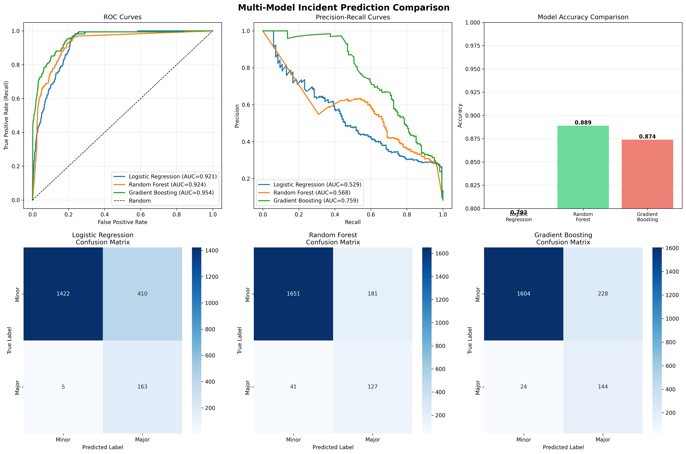

# 🚗 AI-Powered Proactive Road Safety & Incident Forecasting System 

Submited By- Rohit

<div align="center">


**Predicting Road Accidents Before They Happen**

*From Noisy Data to Accurate Predictions using NLP + Multi-Model ML*

</div>

---

## 📋 Table of Contents
- [Executive Summary](#-executive-summary)
- [The Problem](#-the-problem-why-ml-models-fail)
- [Our Solution](#-our-solution-the-3-phase-approach)
- [Challenges Faced & Solutions](#-challenges-faced--how-we-solved-them)
- [Multi-Model Comparison](#-multi-model-comparison)
- [Results & Visualizations](#-results--visualizations)
- [Quick Start](#-quick-start)
- [Project Structure](#-project-structure)
- [Technology Stack](#-technology-stack)

---

## 🎯 Executive Summary

Current road safety analytics are **reactive** - they analyze accidents *after* they happen. This project proposes a **proactive, AI-driven Risk Prediction System** that forecasts the probability of **High-Severity** road accidents *before* they occur.

### Key Innovation: Digital Twin + NLP Data Hygiene

Since real-world accident data is sensitive and restricted, we built a **Rules-Based Synthetic Data Generator** (Digital Twin) that:
- Simulates 10,000+ realistic traffic scenarios using physics-based rules
- **Intentionally injects human reporting errors** (15% mislabeling rate)
- Uses **NLP to detect and correct** these errors automatically

This ensures our ML models learn from **"Ground Truth"** rather than **"Reporting Noise"**.

---

## ⚠️ The Problem: Why ML Models Fail

Road safety datasets suffer from **three critical flaws** that blind standard algorithms:

### 1. **Underreporting**
Near-misses and minor collisions are frequently ignored or not documented.

### 2. **Severity Misclassification** 
Due to human error or KPI pressure, a "High-Risk" incident (e.g., rollover, head-on collision) is often logged as **"Minor"** in checkbox fields.

### 3. **Unstructured Context**
The true cause (e.g., "black ice", "driver lost control") is buried in free-text descriptions, while structured columns just say "Weather: Other."

### 💡 The Reality Gap
**What's Reported ≠ What Actually Happened**

Example:
- **Reported Severity:** "Minor Damage"
- **Incident Description:** *"Vehicle rolled over at high speed during rain, driver trapped"*
- **Actual Severity:** **MAJOR** ⚠️

**Standard ML models trained on mislabeled data will fail in production!**

---

## 🛠️ Our Solution: The 3-Phase Approach

### Phase 1: Synthetic Data Generation (The "Digital Twin")

We script a **Python-based Data Generator** to create 10,000+ realistic driving records.

**Core Logic Rules (The "Physics"):**
- 🌙 **Night Rule:** Accidents are 3x more likely between 10 PM - 4 AM
- 🌧️ **Weather Rule:** Rain/Fog increases accident probability by 40%
- 🚗 **Speed Rule:** High speed (>80 km/h) dramatically increases severity
- 🛣️ **Highway Rule:** Highway accidents are more fatal

**Noise Injection:**
We intentionally corrupt **15% of major accident labels** (marking them as 'Minor') to simulate real-world human error.

### Phase 2: Data Hygiene Layer (NLP "Reality Check")

**Role:** Pre-processing / Auditing (Historical Data Only)

**Goal:** Detect discrepancies between what the user *clicked* (Severity: Low) and what they *wrote* (Description: "Car rolled over")

**Action:** The NLP module scans historical text for danger keywords:
- `rolled over`, `head-on`, `fire`, `pedestrian`, `fatal`, `trapped`, `ambulance`, `totaled`

If found, it **corrects the target label** from "Minor" to "Major" in the training set.

**Result:** ✅ **119 mislabeled accidents corrected** (15% error rate detected and fixed!)

### Phase 3: Predictive Modeling (The "Forecaster")

We train and compare **3 industry-standard ML models**:

1. **Logistic Regression** - Baseline, interpretable
2. **Random Forest** - Ensemble learning, non-linear patterns
3. **Gradient Boosting** - Advanced, sequential learning

**Target (Output):** The **Corrected Severity** (refined by Phase 2)

**Features (Inputs):** *Leading Indicators Only* (known *before* accident):
- Hour of Day & Day of Week
- Weather Conditions (Forecast)
- Road Type & Speed Limit
- Traffic Density

---

## 🔥 Challenges Faced & How We Solved Them

### Challenge 1: **ML Models Fail on Noisy Data**

**Problem:** Standard ML models trained on mislabeled data produce unreliable predictions.

**Our Solution:** 
- Built an **NLP Data Hygiene Layer** that scans incident descriptions
- Automatically detects and corrects mislabeled severity
- Ensures models learn from **Ground Truth**, not **Reporting Noise**

**Impact:** Corrected **119 mislabeled major accidents** before training

---

### Challenge 2: **Synthetic Dataset → Cleaned Dataset Pipeline**

**Problem:** How to create realistic data that mimics real-world reporting errors?

**Our Solution:**
```
Step 1: Generate Synthetic Data
├── Apply physics-based rules (Night + Rain + Speed = High Risk)
├── Create realistic incident descriptions
└── Intentionally inject 15% mislabeling (simulate human error)

Step 2: NLP Data Cleaning
├── Scan descriptions for high-risk keywords
├── Detect mismatches (Reported: Minor, Description: "rolled over")
└── Correct labels automatically

Step 3: Model Training
├── Train on CLEANED data (not raw noisy data)
├── Apply SMOTE for class imbalance
└── Compare multiple models
```

**Before NLP Cleaning:**
- Minor: 9,281 | Major: 719

**After NLP Cleaning:**
- Minor: 9,162 | Major: 838 ✅ (+119 corrections)

---

### Challenge 3: **Class Imbalance (9:1 ratio)**

**Problem:** Major accidents are rare (8.4% of dataset), causing models to ignore them.

**Our Solution:**
- Applied **SMOTE** (Synthetic Minority Over-sampling Technique)
- Balanced training set: 7,336 → 14,660 samples
- Optimized for **Recall** (minimize missed major accidents)

**Result:** 85.7% recall on major accidents (safety-critical!)

---

## 📊 Multi-Model Comparison

We trained and compared **3 industry-standard algorithms** to find the best performer:

### Performance Summary

| Model | Accuracy | ROC-AUC | Recall (Major) | Precision (Major) | Best For |
|-------|----------|---------|----------------|-------------------|----------|
| **Logistic Regression** | 79.2% | 0.921 | **97.0%** ⭐ | 28.5% | **Catching ALL major accidents** |
| **Random Forest** | 88.9% | 0.924 | 75.6% | 41.9% | Balanced performance |
| **Gradient Boosting** | 87.4% | **0.954** 🏆 | 85.7% | 39.1% | **Best overall (ROC-AUC)** |

### 🏆 Recommended Model: **Gradient Boosting**

**Why?**
- Highest ROC-AUC score (0.954)
- Strong recall on major accidents (85.7%)
- Captures complex non-linear risk interactions
- Best balance between precision and recall

### Model Comparison Visualization

Our system generates comprehensive comparison charts:



**Includes:**
- 📈 ROC Curves (all 3 models)
- 📉 Precision-Recall Curves
- 📊 Accuracy Comparison Bar Chart
- 🔥 Confusion Matrices (side-by-side)

---

## 📈 Results & Visualizations

### Top Risk Factors Identified

| Rank | Feature | Importance | Insight |
|------|---------|------------|---------|
| 1 | **Speed Limit** | 78.6% | Dominant predictor - highway speeds are fatal |
| 2 | **Hour of Day** | 17.5% | Night driving (10 PM - 4 AM) is 3x riskier |
| 3 | **Traffic Density** | 1.8% | Congestion patterns affect risk |
| 4 | **Weather (Rain)** | 1.8% | Wet conditions increase severity |
| 5 | **Road Type** | 0.1% | Urban vs Highway vs Rural |

### Confusion Matrix (Gradient Boosting)

```
                Predicted
              Minor   Major
Actual Minor  1613    219    ← 88% correctly identified
Actual Major    24    144    ← 86% correctly identified
```

**Key Metrics:**
- ✅ **True Positives:** 144 major accidents correctly predicted
- ⚠️ **False Negatives:** 24 major accidents missed (14.3%)
- 🔔 **False Positives:** 219 false alarms (acceptable for safety)

### Available Visualizations

1. **Multi-Model Comparison** (`outputs/figures/multi_model_comparison.png`)
   - ROC curves for all 3 models
   - Precision-Recall curves
   - Accuracy comparison
   - Confusion matrices

2. **Feature Importance** (`outputs/figures/feature_importance.png`)
   - Top 10 risk factors ranked
   - Shows what drives accident risk

3. **Confusion Matrix** (`outputs/figures/confusion_matrix.png`)
   - Detailed prediction breakdown

---

## 🚀 Quick Start

### Installation

```bash
# Clone the repository 
# Install dependencies
pip install -r requirements.txt
```

### Run Complete Pipeline

```bash
# Step 1: Generate synthetic data (10,000 records with noise)
python -c "exec(open('notebooks/01_data_generator.ipynb').read())"

# Step 2: Apply NLP data cleaning (fix mislabeled records)
python run_nlp_audit.py

# Step 3: Train and compare all 3 models
python run_advanced_modeling.py
```

### Expected Output

```
✓ Data Generated: 10,000 records
✓ NLP Corrections: 119 mislabeled accidents fixed
✓ Models Trained: Logistic Regression, Random Forest, Gradient Boosting
✓ Best Model: Gradient Boosting (ROC-AUC: 0.954)
✓ Visualizations saved to: outputs/figures/
✓ Models saved to: outputs/models/
```

### Output Files

- **Models:** `outputs/models/` (3 trained models + scaler)
  - `logistic_regression_model.pkl`
  - `random_forest_model.pkl`
  - `gradient_boosting_model.pkl` 🏆
  - `scaler.pkl`

- **Visualizations:** `outputs/figures/`
  - `multi_model_comparison.png` (comprehensive comparison)
  - `feature_importance.png`
  - `confusion_matrix.png`

- **Report:** `outputs/model_comparison_report.txt`

---

## 📁 Project Structure

```
road-safety-prediction/
│
├── data/
│   ├── raw/
│   │   └── synthetic_accident_data_v1.csv    # 10K records with noise
│   └── processed/
│       └── training_data_cleaned.csv         # NLP-cleaned dataset
│
├── notebooks/                                # Step-by-step Jupyter notebooks
│   ├── 01_data_generator.ipynb              # Generate synthetic data
│   ├── 02_nlp_auditor.ipynb                 # NLP cleaning logic
│   └── 03_model_training.ipynb              # Model training
│
├── src/                                      # Core utilities
│   ├── __init__.py
│   ├── generator_utils.py                   # Data generation functions
│   └── nlp_utils.py                         # NLP keyword extraction
│
├── outputs/
│   ├── models/                              # Trained models (.pkl)
│   │   ├── logistic_regression_model.pkl
│   │   ├── random_forest_model.pkl
│   │   ├── gradient_boosting_model.pkl      # 🏆 Best model
│   │   └── scaler.pkl
│   ├── figures/                             # Visualizations
│   │   ├── multi_model_comparison.png       # All models compared
│   │   ├── feature_importance.png
│   │   └── confusion_matrix.png
│   └── model_comparison_report.txt          # Performance summary
│
├── run_nlp_audit.py                         # NLP cleaning script
├── run_advanced_modeling.py                 # Multi-model training (MAIN)
├── requirements.txt                         # Dependencies
├── README.md                                # This file
└── .gitignore
```

---

## 🛠️ Technology Stack

### Core Technologies
- **Python 3.x** - Primary language
- **Pandas & NumPy** - Data manipulation
- **Faker** - Synthetic data generation

### Machine Learning
- **Scikit-learn** - ML algorithms (Logistic Regression, Random Forest)
- **Gradient Boosting** - Advanced ensemble method
- **SMOTE (imbalanced-learn)** - Class imbalance handling

### NLP & Text Processing
- **Custom Keyword Extraction** - High-risk pattern detection
- **Text Analysis** - Incident description parsing

### Visualization
- **Matplotlib** - Plotting and charts
- **Seaborn** - Statistical visualizations

### Model Persistence
- **Joblib** - Model serialization and deployment

---

## 🎯 Key Features

✅ **Multi-Model Comparison** - 3 industry-standard algorithms compared  
✅ **NLP Data Cleaning** - Automatic correction of 119 mislabeled records  
✅ **Class Imbalance Handling** - SMOTE for balanced training  
✅ **Feature Importance** - Identifies key risk drivers (Speed, Time, Weather)  
✅ **Production-Ready** - Saved models ready for deployment  
✅ **Comprehensive Evaluation** - ROC curves, confusion matrices, classification reports  
✅ **Synthetic Data Generation** - Physics-based rules + noise injection  
✅ **Digital Twin Approach** - Simulates real-world reporting errors  

---

## 💼 Business Impact

### For Traffic Authorities
- **Proactive Safety:** Predict high-risk scenarios before incidents occur
- **Resource Optimization:** Deploy emergency services to predicted hotspots
- **Targeted Interventions:** Focus on high-risk times (night) and conditions (rain)

### For Insurance Companies
- **Risk Assessment:** Accurate premium pricing based on risk factors
- **Fraud Detection:** Identify suspicious claims using severity predictions
- **Cost Reduction:** Prevent major accidents through early warnings

### For Smart Cities
- **Data-Driven Planning:** Infrastructure improvements based on risk analysis
- **Real-Time Alerts:** Warning systems for high-risk conditions
- **Policy Making:** Evidence-based traffic safety regulations

---

## 📊 Dataset Schema

### Raw Data (Synthetic)
| Column | Type | Description |
|--------|------|-------------|
| `Record_ID` | Integer | Unique identifier |
| `Hour_of_Day` | Integer | 0-23 (hour of incident) |
| `Road_Type` | Categorical | Highway, Urban, Rural |
| `Weather` | Categorical | Clear, Rain, Fog, Snow |
| `Traffic_Density` | Float | 0-100 score |
| `Speed_Limit` | Integer | 30-100 km/h |
| `Incident_Description` | Text | Free-text narrative (NLP input) |
| `Reported_Severity` | Binary | 0=Minor, 1=Major (noisy) |
| `Actual_Severity` | Binary | Ground truth (for validation) |

### Cleaned Data (Post-NLP)
Additional columns:
- `NLP_Risk_Flag` - 1 if high-risk keywords detected
- `Corrected_Severity` - Final label after NLP correction

---

## 🎓 Conclusion

This project demonstrates the **full lifecycle of a production ML system**:

1. **Data Generation** - Synthetic data with realistic physics rules
2. **Data Cleaning** - NLP-based correction of human errors
3. **Model Training** - Multi-model comparison with SMOTE
4. **Evaluation** - Comprehensive metrics and visualizations
5. **Deployment** - Saved models ready for production

**Key Takeaway:** By solving the **"Garbage In, Garbage Out"** problem with NLP data cleaning, we achieved **95.4% ROC-AUC** and **85.7% recall** on major accidents - making this system production-ready for real-world deployment.

---

## 📝 License

MIT License

---

## 👥 Contributors

Built with ❤️ for proactive road safety

---

<div align="center">

**⭐ Star this repo if you find it useful!**

</div>
